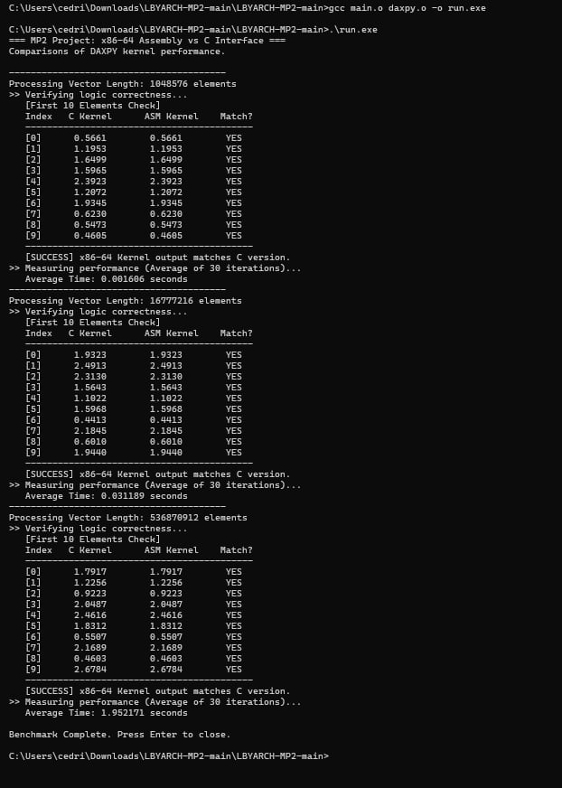

## LBYARCH-MP2: : x86-to-C Interface Programming Project

# Group Members:
- Young, Cedric
- Ross, Isabella Althea R. Ross
- S18A

# PROJECT OVERVIEW:
This project implements a kernel to perform the DAXPY function ($Z = A \cdot X + Y$) using:

1. A C version (host and reference).
2. An x86-64 Assembly version (using scalar double-precision instructions).
The Assembly kernel's execution times for various vector sizes (2^10, 2^24, 2^29) are measured and compared in this project.

# I. COMPARATIVE EXECUTION TIME:
PERFORMANCE RESULTS: Average execution time over 30 iterations.

| Vector Size | Input Length (n) | Average Time (Seconds) |
| :--- | :--- | :--- |
| $2^{20}$ | 1,048,576 | 0.001606 |
| $2^{24}$ | 16,777,216 | 0.031189 |
| $2^{29}$ | 536,870,912 | 1.952171 |

Note: Timings were recorded on a Windows environment using high-precision QueryPerformanceCounter.

PERFORMANCE ANALYSIS:
Scalar SIMD instructions (MOVSD, MULSD, and ADDSD) were used in a loop to implement the x86-64 assembly kernel, processing one element at a time. While allowing for manual register management (using RCX for the counter and XMM registers for floating-point arithmetic), this mimics the logic of the C kernel.

The comparative findings demonstrate that the assembly implementation performs as intended and offers a straightforward, low-level execution of the DAXPY formula.

# II. AND III. SCREENSHOTS OF PROGRAM OUTPUT (C & x86-64 CHECK)
The screenshot below demonstrates the correctness check for both the C version (Column 2) and the x86-64 version (Column 3).

- Sanity Check: PASSED (See [SUCCESS] message).
- First 10 Elements: ALL MATHCED (See table)

# IV. VIDEO DEMONSTRATION:
Video link:  

******
# Type instructions below into CMD in the folder to run
******

nasm -f win64 daxpy.asm -o daxpy.o

gcc -c main.c -o main.o

gcc main.o daxpy.o -o run.exe

.\run.exe
